[back to CMIP7 ancillaries](CMIP7_ancillaries.md)

## Solar forcing for HadCM3

### Where to access data
You can find introduction of solar forcing from [Homepage of SOLARIS-HEPPA](https://www.solarisheppa.kit.edu/index.php), the [CMIP7 Solar forcing](https://www.solarisheppa.kit.edu/75.php), and the paper [Funke et al., 2024](https://gmd.copernicus.org/articles/17/1217/2024/).

Data can be access from links [monthly resolution reference solar forcing](https://cloud.iaa.es/index.php/s/n7cacmRBjk5Gb8f), and [daily resolution reference solar forcing](https://cloud.iaa.es/index.php/s/nJFTPcnFwZ3smTo).

To be noticed, the CMIP7 solar forcing provides data ranging from 1850-2023 (1850-1873 for pre-industrial control; version 4.6). While CMIP6 provides data from 1850-2299 (version 3.2).

However, the link for downloading CMIP6 solar forcing data are now overwritten by the CMIP7 one. But you can access data from my previous saved file: [monthly resolution reference solar forcing for CMIP6](Attachments/CMIP7_fcg_solar/solarforcing-ref-mon_input4MIPs_solar_CMIP_SOLARIS-HEPPA-3-2_gn_18500101-22991231.nc).

### How to process data

#### Total Solar Irradiation (TSI)
The HadCM3B model requires time-varying Total Solar Irradiation (TSI) file in annual mean resolution, saving as a `.dat` file with two columns (`year value`), without column name. So we need to convert the original monthly data into annual mean format. You can use this python script to convert and plot data: [Convert_TSI_data.ipynb](Attachments/CMIP7_fcg_solar/Convert_TSI_data.ipynb)

You can get the converted annual mean **varying_TSI_CMIP6.dat** file, for example, from [local path](Attachments/CMIP7_fcg_solar/varying_TSI_CMIP6.dat) (can be opened with Notepad), or in `BC4:/user/home/mf22281/um_updates/`.

The file looks like this:  

The TSI data for CMIP6:  
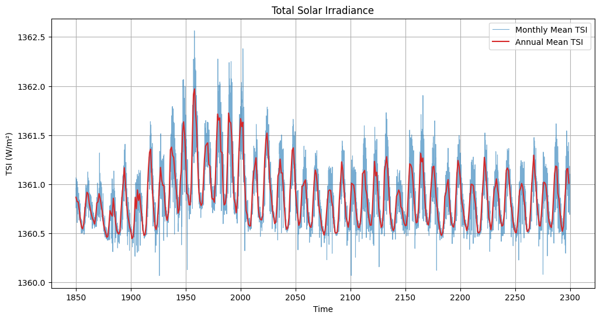

#### Spectrum
coming soon ...

### How to implement the forcing into HadCM3

#### Setup a transient TSI job
Tutorial: [Tutorial of Solar Orbit Setup_202503.docx](<Attachments/CMIP7_fcg_solar/Tutorial of Solar Orbit Setup_202503.docx>)

Key process:
- copy a standard HadCM3B job. 
- setup a module in PUMA2, UMUI window:

> Model Selection  
-> sub-model independent  
-> compilation and modification  
-> modifications for the model  
-> Fortran Mods table
> |Fortran modes | Include Y/N |
> |--------------|-------------|
> |$PV_UPDATES/solar_orbit_real1950.mod|Y|

Where $PV_UPDATAES: `BC4:/mnt/storage/private/bridge/swsvalde/um_updates/`

- Include time-varying TSI file and turn on related options in PUMA2, UMUI window:
> Model Selection  
-> sub-model independent  
-> Script inserts and modifications  
-> Defined Environment Variable  
>> `L_SEC_VAR: .TRUE.`: set orbit changing through time  
>> `L_SOLAR_SPEC: .TRUE.`: set solar spectrum changing through time  
>> `ORB_REAL_YEAR: 0`  
>> `ORB_OFFSET_YEAR: 0`  
>> `SOLAR_FILE: /home/mf22281/um_updates/varying_TSI_CMIP6.dat` (change file path and name as you want)

- save
- process
- copy job from PUMA2 to `BC4:~/umui_jobs/`

You can further check or modify the setting in
`BC4:~/umui_jobs/jobid/MODS_UM`:  

`BC4:~/umui_jobs/jobid/CNTLATM`:  
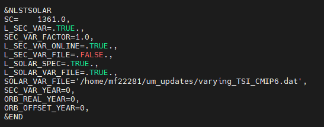

`BC4:~/umui_jobs/jobid/SCRIPT`:  

## Setting
### Control run: xqcpz
A copy of the standard HadCM3B job, tdaag, which is HadCM3-MOSES2.1-TRIFFID_dyn, Pre-industrial.  
Solar constant = 1361.0 $W/m^2$.  
re-run from year 1850 to 2299.  
check setting and results of xqcpz and xqcpz-tdaag [here](https://www.paleo.bristol.ac.uk/ummodel/data/xqcpz/standard_new_html/xqcpz.html)
### Test effectivess of solar setting: xqcpb
solar file set as `BC4:/user/home/mf22281/um_updates/shift_TSI.dat`.  
This job is used to test the effectiveness of the solar setting.    
This solar file set the TSI values start from 1361 $W/m^{2}$ for 20 years, then suddenly shift to a larger value (1391 $W/m^{2}$) for 10 years, then shifts back to 1361 $W/m^{2}$ for the remaining years.  
Set running from year 1850 to 2299.  
check setting and results of xqcpb and xqcpb-xqcpz [here](https://www.paleo.bristol.ac.uk/ummodel/data/xqcpb/standard_new_html/xqcpb.html)  
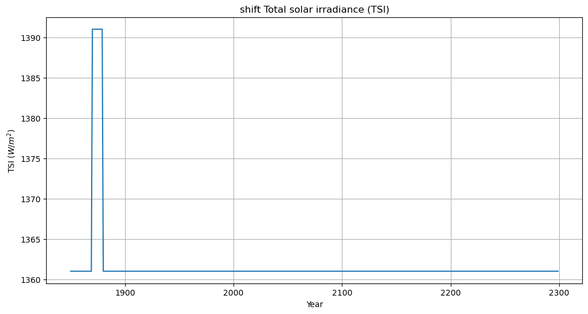
### Test with CMIP6 TSI: xqcpa
solar file set as `BC4:/user/home/mf22281/um_updates/varying_TSI_CMIP6.dat`  
running from year 1850 to 2299.  
check setting and results of xqcpa and xqcpa-xqcpz [here](https://www.paleo.bristol.ac.uk/ummodel/data/xqcpa/standard_new_html/xqcpa.html)  
### Test with CMIP7 TSI
coming soon ...

### Test with CMIP7 spectrum
coming soon ...

## Result
### compare shift_TSI job with standard_PI job (xqcpb - xqcpz)  
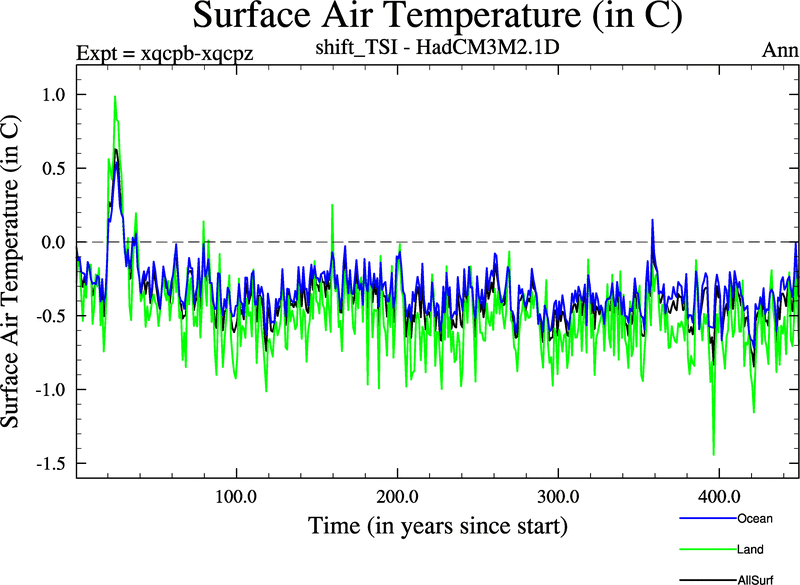   
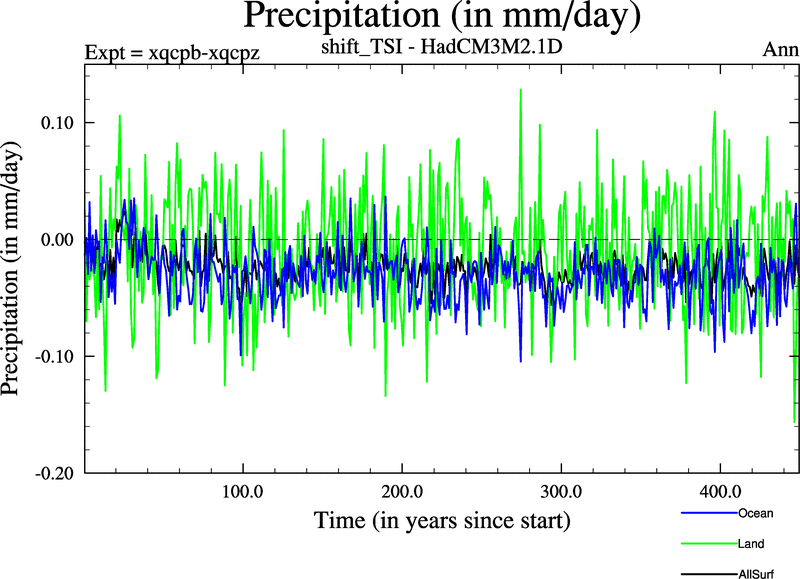  
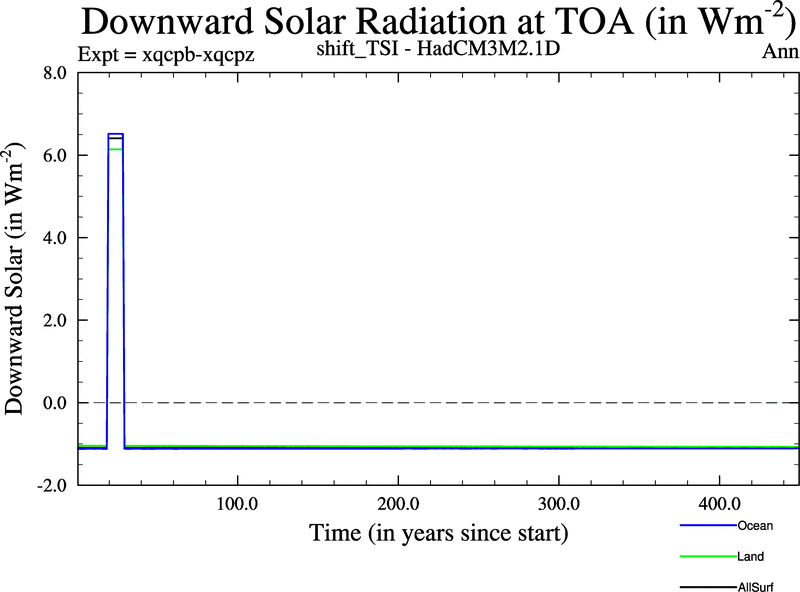
  
  
### compare TSI_CMIP6 with standard PI job (xqcpa - xqcpz)
#### Surface air temperature
  
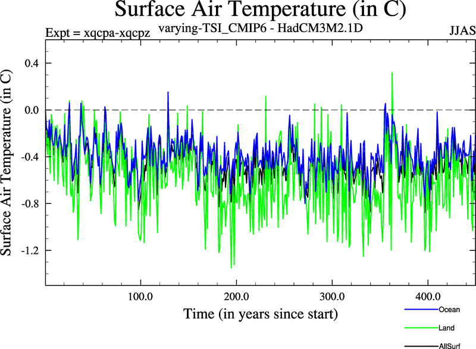  
  

#### Precipitation and Evaporation
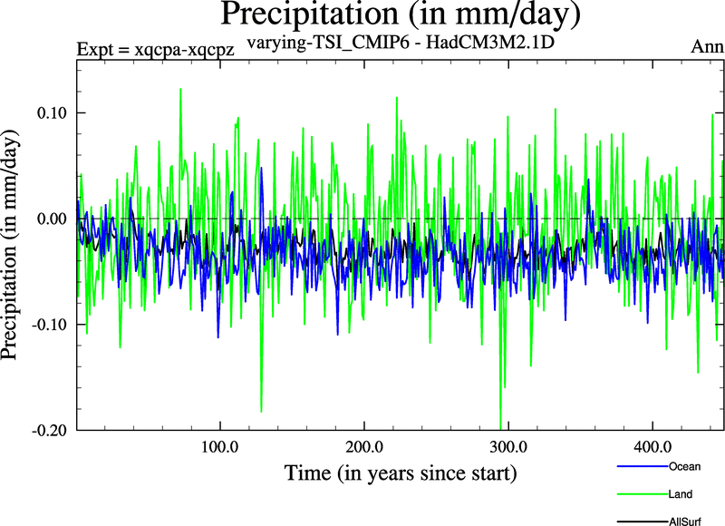  
  
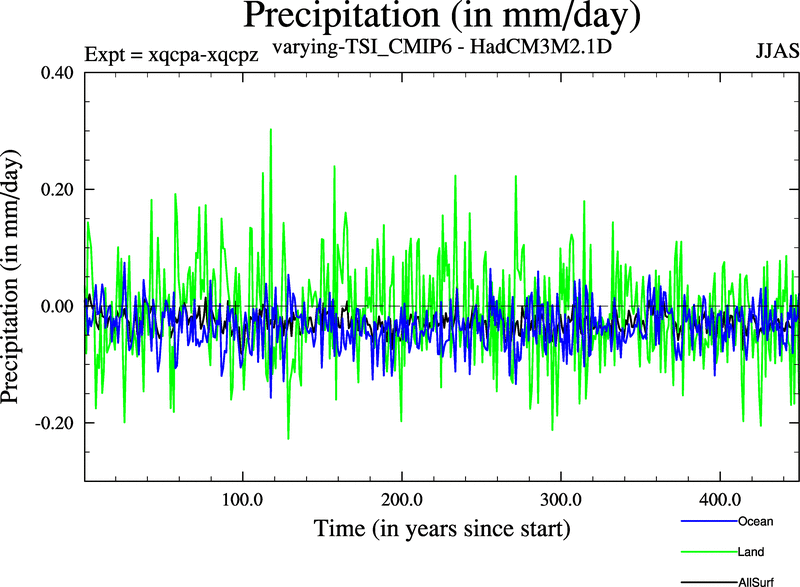  
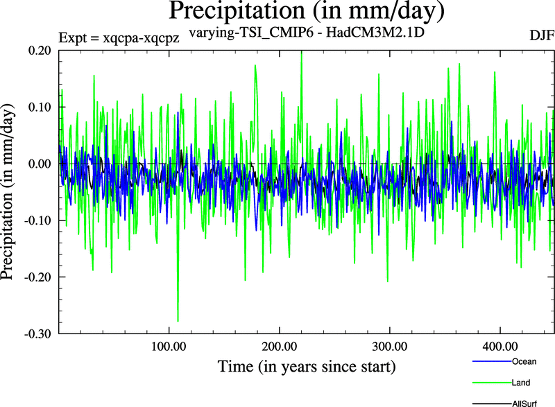  
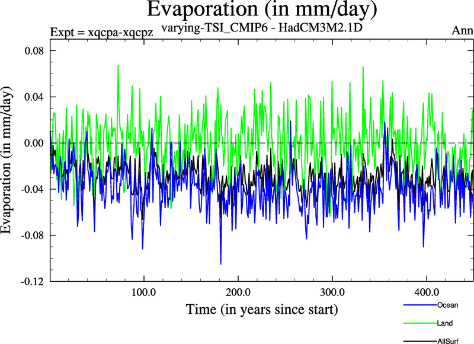  
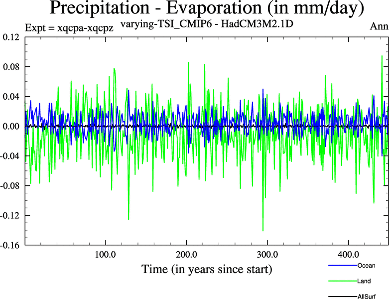  

#### Mean sea level pressure
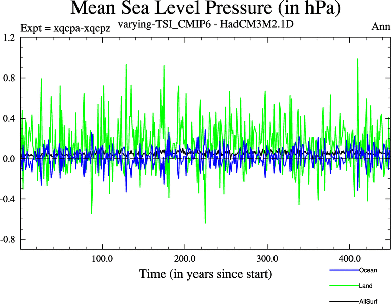  

#### Solar radiation
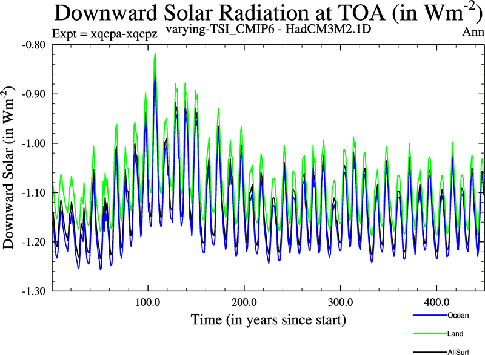  
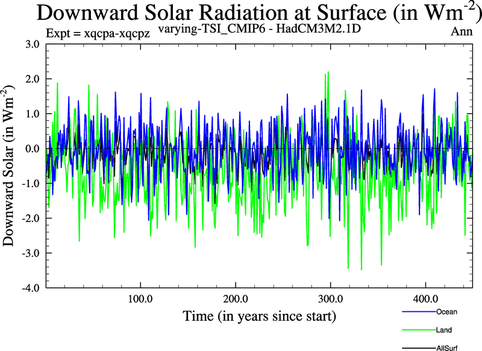  
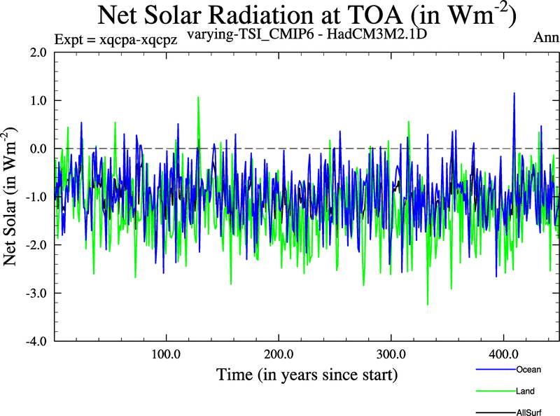  
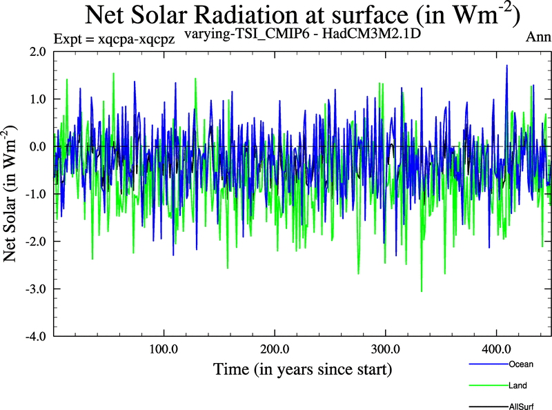  

#### Longwave radiation
  
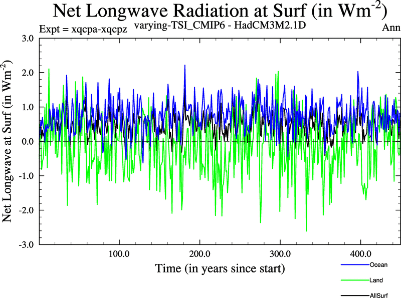  
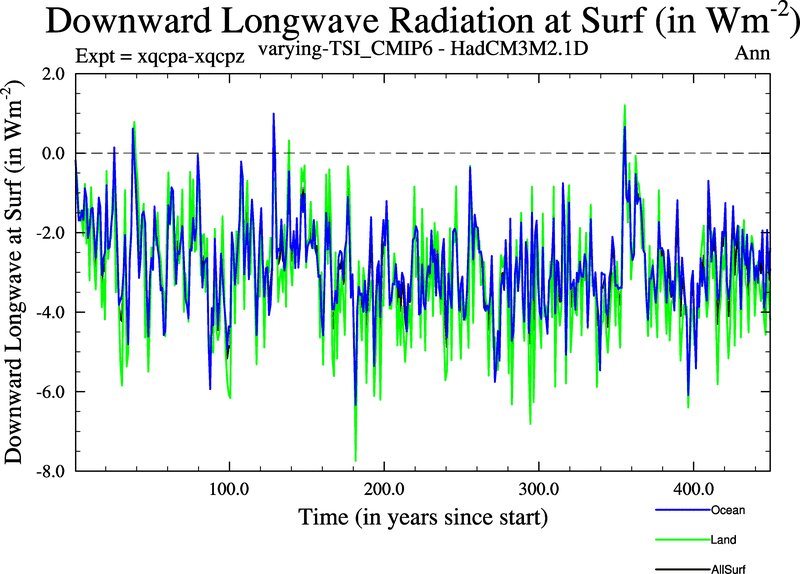  

#### Net radiation
  

#### Heat fluxes
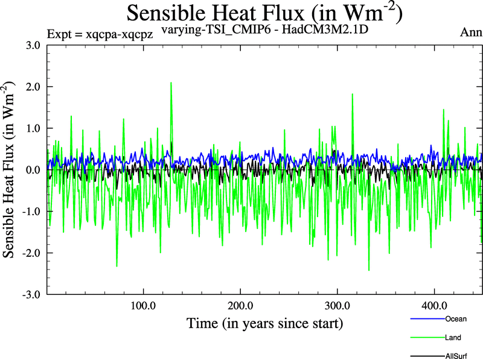  
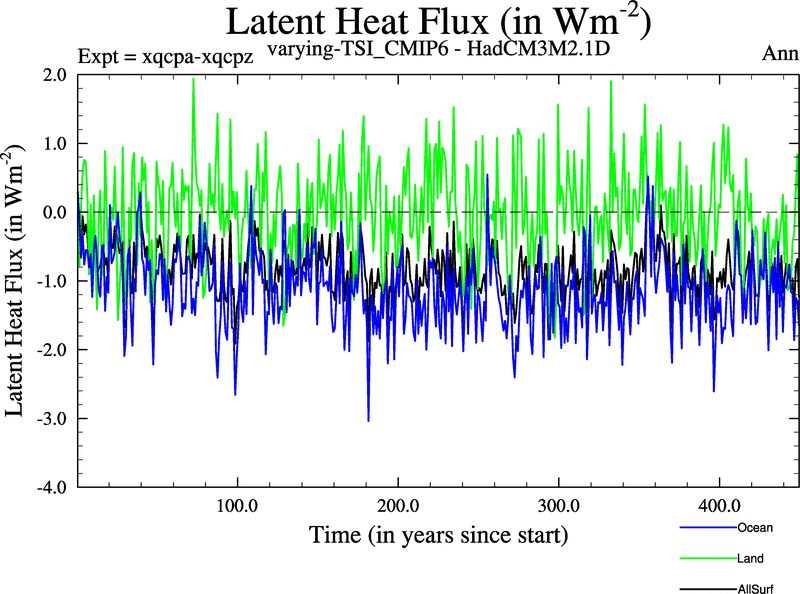  

#### Total cloud cover (random overlap)
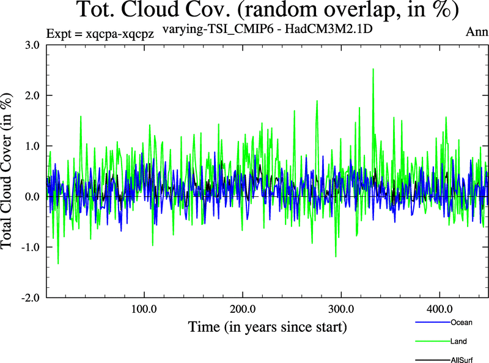  

